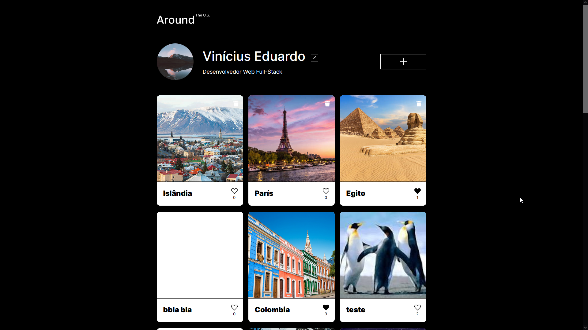
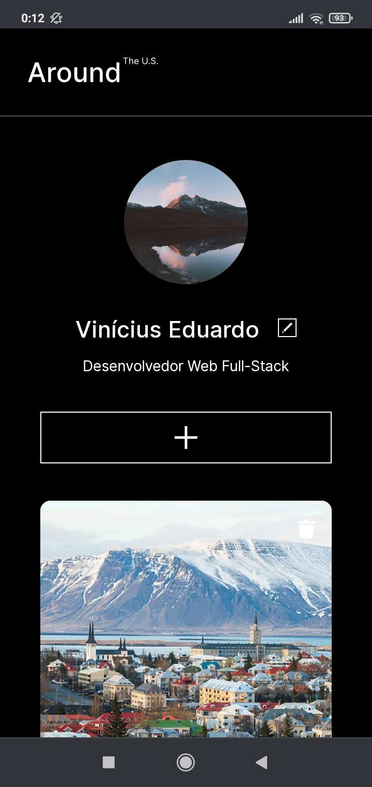
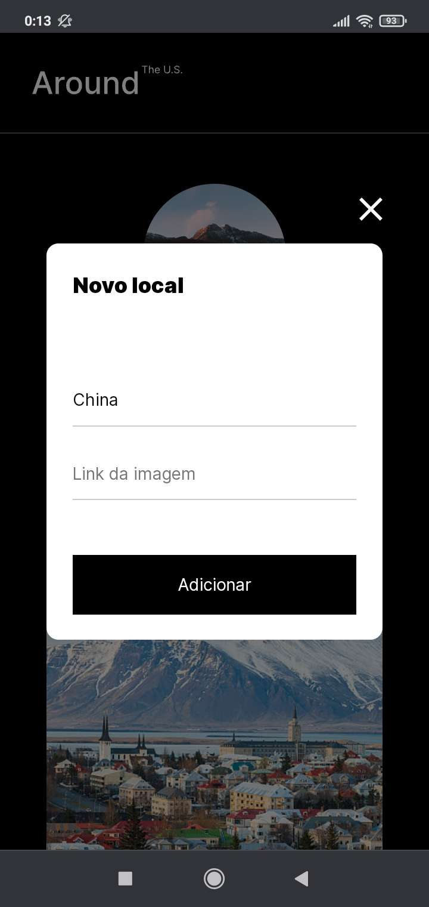

# Around the US

  

## About

A single page application where users can post photos and like photos uploaded by other users.

This was a project made for TripleTen's online web development bootcamp.
It was made to practice using javascript classes and modules, form validation, and the integration of the webpage with a server.

### Click [here](https://anynoise00.github.io/around-the-us/) to visit the website.

## Mobile layout

 

## Technologies

The following tools where used for building this project:

- HTML, CSS & JavaScript
- BEM methodology
- Webpack

## Credits

This projects uses [TripleTen](https://tripleten.com/)'s figma template  
?type=design&node-id=0-1&mode=design&t=ClOh3EiGpuWKWXEn-0)
